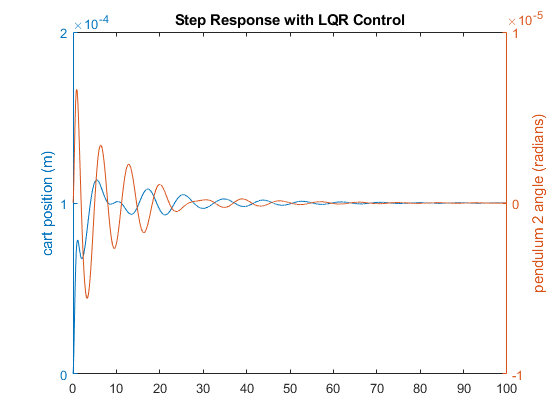

# Double-Pendulum-with-Cart
Designing a controller for stabilization of pendulums to its equilibrium state with its animation.

## Pendulum System.

  

Animation of Controlled motion.

# Steps of Project

## Made non-Linear system
Using Euler-Lagrangian equation to find a non-linear system of the given configuration.
## Linearized about equilibrium point
Then the system was linearized about the equilibrium point.  So that we can use the knowledge of linear system controller and can control system locally around the equilibrium point.

## Designed LQR system by choosing Q and R matrix for linear and non-linear system.
Choosing Q and R matrix big because given values of mass and lenght were very large and to change the dynamics we need such capable controller.

Linear system stabilized.

  

Stability of first pendulum with cart.

  

  

Stability of Second pendulum with cart.

### For non linear systems

  

Simulink system for nonlinear control

  

  

Internal structure of LQR of non-linear

## Designed Luenberger Observer for linear and non-linear system .

  

Output of observer for linear system.
  

  

Simulink system for nonlinear observer.
  

## Designed LQG for linear and non-linear system . 

  

Simulink system for nonlinear LQG controller.
  

Note: If details required refer to the following report.

[Report](Robot_Controls_Final_project.pdf)
